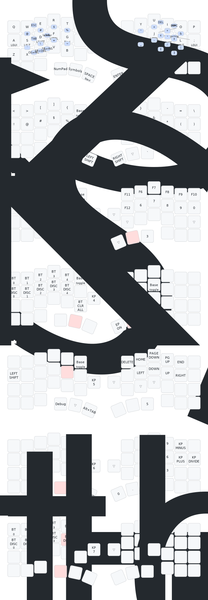

# zmk-config

ZMK firmware configuration for [Cornix LP](https://github.com/hitsmaxft/zmk-keyboard-cornix) split keyboard with rotary encoders.

[日本語版はこちら](README.ja.md)

## Keymap

See [Combo Reference](docs/combos.md) for all combo key bindings and [Configuration Reference](docs/configuration.md) for behaviors, macros, and firmware settings.

## Build

Firmware is built automatically via GitHub Actions on push.
Download `.uf2` files from the [latest Actions run](https://github.com/LevNas/zmk-config/actions).

### Flashing

1. Put the keyboard half into UF2 bootloader mode (double-tap reset button)
2. Copy `cornix_left.uf2` to the left half, `cornix_right.uf2` to the right half
3. If switching from another firmware, flash `reset.uf2` to both halves first to clear BT bonding

## Customization

Want to use this as a starting point? See the [Fork Guide](docs/fork-guide.md).

## Hardware

- Board: Cornix LP (split, nRF52840)
- Rotary encoders: 2 (left: volume, right: page up/down)
- No dongle
